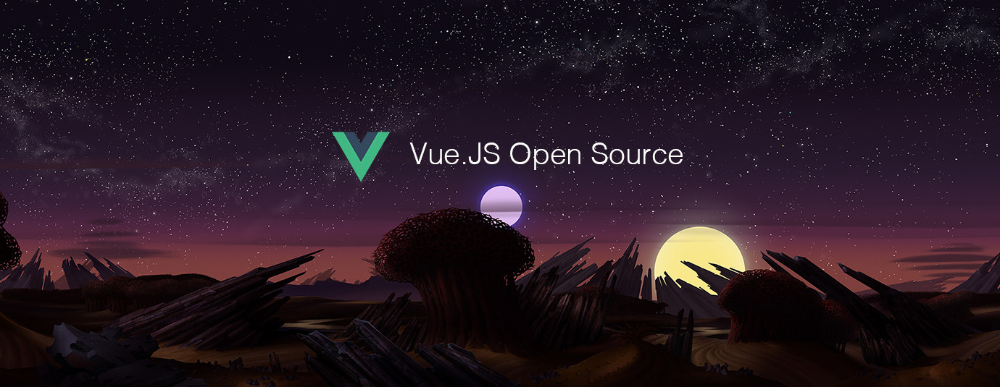

# Vue.js Top 10 Open Source for the Past Month (v.Sep 2018)

</a>

For the past month, we ranked nearly 150 Vue.js Open Source Projects to pick the Top 10. 
We compared projects with new or major release during this period. Mybridge AI ranks projects based on a variety of factors to measure its quality for professionals.

* Average number of Github stars in this edition: 268⭐️
* Topics: Zoomable user interfaces, Wysiwyg, UI kit, Autosuggest, Autosave, Transition, VSCode, Sidebar, API, Fluent Design

Open source projects can be useful for programmers. Hope you find an interesting project that inspires you.

 

### Course of the month:

[A) Beginners: Vue JS 2 — The Complete Guide (incl. Vue Router & Vuex).](http://bit.ly/2CZ1kvh) [17,908 recommends, 4.7/5 stars]

[B) Vue JS Essentials with Vuex and Vue Router.](http://bit.ly/2wXecRD) [306 recommends, 4.8/5 stars]

 

## Rank 1
### [ZircleUI: A frontend library to develop zoomable user interfaces. Based on Vue.js [★469]](https://github.com/zircleUI/zircleUI?utm_source=mybridge&utm_medium=blog&utm_campaign=read_more)

 

## Rank 2
### [Tiptap: A rich-text editor for Vue.js  [★344]](https://github.com/heyscrumpy/tiptap?utm_source=mybridge&utm_medium=blog&utm_campaign=read_more)

 

## Rank 3
### [Shards-vue: A free, beautiful and modern Vue.js UI kit based on Shards. [★96]](https://github.com/DesignRevision/shards-vue?utm_source=mybridge&utm_medium=blog&utm_campaign=read_more)

 

## Rank 4
### [Vue-autosuggest:  Vue autosuggest component. [★121]](https://github.com/Educents/vue-autosuggest?utm_source=mybridge&utm_medium=blog&utm_campaign=read_more)

 

## Rank 5
### [Vue-auto-storage:  An automatic storage plugin for Vue2, persist the data with localStorage. [★68]](https://github.com/zh-rocco/vue-auto-storage?utm_source=mybridge&utm_medium=blog&utm_campaign=read_more)

 

## Rank 6
### [Vue-smooth-reflow: Transition an elements reflow when the data changes. [★132]](https://github.com/guanzo/vue-smooth-reflow?utm_source=mybridge&utm_medium=blog&utm_campaign=read_more)

 

## Rank 7
### [Vue-theme-vscode: +30300 installs ⬇️ I created this theme for Visual Studio Code inspired by Vue.js, with support for more popular languages, trying to maintain a perfect harmony of colors. [★21]](https://github.com/mariorodeghiero/vue-theme-vscode?utm_source=mybridge&utm_medium=blog&utm_campaign=read_more)

 

## Rank 8
### [Vue-burger-menu:  An off-canvas sidebar Vue component  [★94]](https://github.com/mbj36/vue-burger-menu?utm_source=mybridge&utm_medium=blog&utm_campaign=read_more)

 

## Rank 9
### [Vue-create-api: Make Vue component's invocation by API. [★59]](https://github.com/cube-ui/vue-create-api?utm_source=mybridge&utm_medium=blog&utm_campaign=read_more)

 

## Rank 10
### [Vuent:  Vue.js components implementing Microsoft Fluent Design [★43]](https://github.com/arturmiz/vuent?utm_source=mybridge&utm_medium=blog&utm_campaign=read_more)
