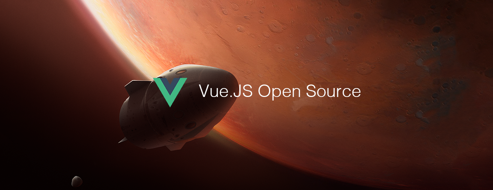

# Vue.js Open Source of the Month (v.Oct 2018)

</a>

For the past month, we ranked nearly 150 Vue.js Open Source Projects to pick the Top 10. 
We compared projects with new or major release during this period. Mybridge AI ranks projects based on a variety of factors to measure its quality for professionals.

* Average number of Github stars in this edition: 464 ⭐️
* Topics: Directory Tree, Netfilix, Sample Shop, Drag and Drop, Laravel Admin, Real World, Shards Vue, SFC, Electron, Aspect Ratio

Open source projects can be useful for programmers. Hope you find an interesting project that inspires you.

 

### Course of the month:

[A) Beginners: Vue JS Essentials with Vuex and Vue Router.](http://bit.ly/2wXecRD) [371 recommends, 4.8/5 stars]

[B) Full-Stack Vue with GraphQL — The Ultimate Guide.](http://bit.ly/2yau7Nf) [58 recommends, 4.7/5 stars]

 

## Rank 1
### [Project-explorer: A CLI tool to create an annotated tree visualization of any project [★417]](https://github.com/sdras/project-explorer?utm_source=mybridge&utm_medium=blog&utm_campaign=read_more)

 

## Rank 2
### [Monimo: Netflix like web app for watching animes [★147]](https://github.com/altinselimi/monimo?utm_source=mybridge&utm_medium=blog&utm_campaign=read_more)

 

## Rank 3
### [Sample-vue-shop: A sample shop that shows how to manage payments with Vue, Stripe, and Serverless Functions [★767]](https://github.com/sdras/sample-vue-shop?utm_source=mybridge&utm_medium=blog&utm_campaign=read_more)

 

## Rank 4
### [Vue-grid-layout: A draggable and resizable grid layout, for Vue.js. [★1615]](https://github.com/jbaysolutions/vue-grid-layout?utm_source=mybridge&utm_medium=blog&utm_campaign=read_more)

 

## Rank 5
### [Mojito: An admin component built with laravel and vue [★136]](https://github.com/moell-peng/mojito?utm_source=mybridge&utm_medium=blog&utm_campaign=read_more)

 

## Rank 6
### [Vue-realworld-example-app: An exemplary real-world application built with Vue.js, Vuex, axios and different other technologies.  [★766]](https://github.com/gothinkster/vue-realworld-example-app?utm_source=mybridge&utm_medium=blog&utm_campaign=read_more)

 

## Rank 7
### [Shards-vue: A free, beautiful and modern Vue.js UI kit based on Shards. [★216]](https://github.com/DesignRevision/shards-vue?utm_source=mybridge&utm_medium=blog&utm_campaign=read_more)

 

## Rank 8
### [Vuese: Your vue SFC is your document - Parsing Vue SFC and generating documentation. [★255]](https://github.com/HcySunYang/vuese?utm_source=mybridge&utm_medium=blog&utm_campaign=read_more)

 

## Rank 9
### [Vue-cli-plugin-electron-builder: A Vue Cli 3 plugin for Electron with no required configuration [★250]](https://github.com/nklayman/vue-cli-plugin-electron-builder?utm_source=mybridge&utm_medium=blog&utm_campaign=read_more)

 

## Rank 10
### [Vue-free-transform: VueJS Free transform tool component [★90]](https://github.com/skmail/vue-free-transform?utm_source=mybridge&utm_medium=blog&utm_campaign=read_more)

                    
